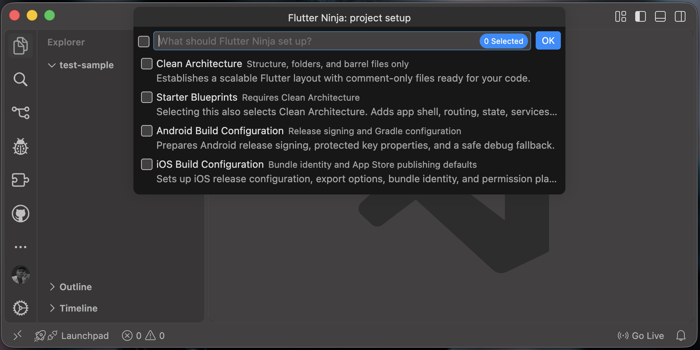
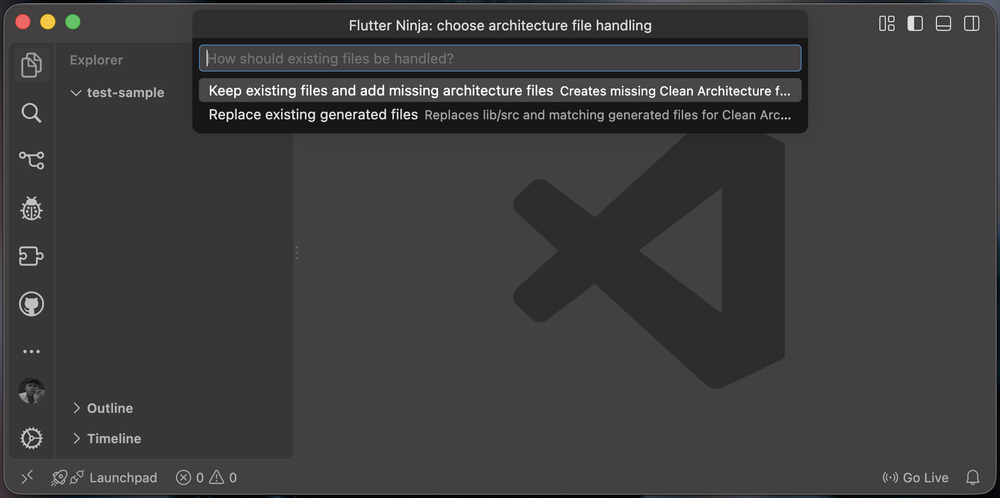
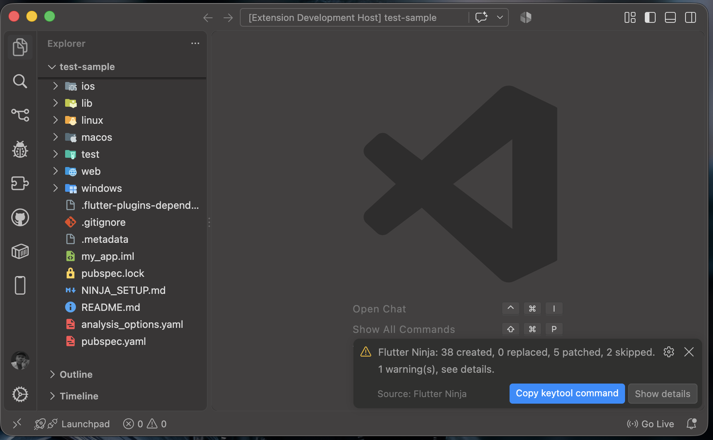

# Flutter Ninja

Scaffold a clean, production-ready Flutter app shell in minutes — architecture, starter code, and Android/iOS build setup, each optional and independently selectable.

Flutter Ninja is open source. Contributions are welcome at:
**https://github.com/macmaurice-osuji/flutter-ninja** *(replace with your actual repo URL)*

## Why this exists

Starting a Flutter project usually means repeating the same setup work: folder conventions, wiring providers and app state, route and shell structure, app constants/theme/utilities, and Android/iOS build configuration. Flutter Ninja automates that baseline so you start on real feature work sooner.

## Features

Every option below is independently selectable, so you can generate just what you need or all four in one pass.

- **Clean Architecture** — creates the complete folder layout and barrel files, with short start-here placeholders in each file. Implementation decisions stay yours.
- **Starter Core Blueprints** — fills that architecture with a working app shell, routing (go_router), state management (Riverpod), an API service (Dio), local preferences, and example home/settings screens.
- **Android Build Configuration** — sets up Gradle release signing with a protected `key.properties` file and a safe debug fallback. Existing credentials are never overwritten.
- **iOS Build Configuration** — sets up bundle identity, release configuration, export options, and editable permission-string placeholders for App Store delivery.

Built-in safeguards:

- Project validation before generation, with clear warnings for risky states
- A choice between **keep** (add only missing files) and **replace** (overwrite generated files; `lib/src` goes to Trash, recoverable) for architecture and blueprints
- Android and iOS setup each get their own confirmation and only touch their own platform
- Existing Android signing files are never overwritten
- A summary report after every run, listing what was created, replaced, skipped, and any warnings

## Usage

1. Open the folder you want to generate into (or right-click a folder in the Explorer).
2. Open the Command Palette (`Cmd+Shift+P` / `Ctrl+Shift+P`).
3. Run **Flutter Ninja: Configure Project**.
4. Choose any combination of the four setup options.
5. For a new project, enter a package name, organization, display name, and description. For an existing project, these are read from `pubspec.yaml` and never renamed.
6. If matching files already exist, choose **keep** or **replace**.
7. Review the summary and, for Android, use the **Copy keytool command** button to generate your release keystore.

## Commands

| Command | Description |
|---|---|
| `Flutter Ninja: Configure Project` | Opens the setup flow: choose modules, enter project details, and generate. Also available from the Explorer right-click menu on a folder. |

## Settings

Flutter Ninja has no configurable settings yet — every choice (which modules to run, keep vs. replace, project details) is made in the setup flow each time you run the command.

## Screenshots

**1. Choose what to set up**

Pick any combination of Clean Architecture, Starter Blueprints, Android Build Configuration, and iOS Build Configuration. Starter Blueprints automatically includes Clean Architecture, so you always get a valid structure.

**2. Decide how to handle existing files**

If matching files already exist, Flutter Ninja pauses and asks before touching anything. **Keep** adds only what's missing; **Replace** moves `lib/src` to the Trash (recoverable) and regenerates it.

**3. Get a quick summary when it's done**

A short notification confirms the result, with a one-click button to copy the `keytool` command for generating your Android release keystore.

## Requirements

- VS Code 1.90 or later
- Flutter SDK installed and available on your PATH (required for the "flutter create" and "flutter pub add" steps)
- An existing Flutter project, or an empty folder to create one in

## Known Issues

- Only Kotlin DSL (`build.gradle.kts`) Android projects are auto-patched for signing; Groovy (`build.gradle`) projects get a warning instead and need the signing block added manually.
- Renaming an existing project's package name, Android `applicationId`, or iOS bundle ID is not performed automatically, since that's risky on a live project.
- No settings UI yet to pre-select default modules or dependencies.

Found a bug or have a feature request? Please open an issue or pull request against `development` in the repo linked above.

## Contributing

1. Fork the repository.
2. Create a feature branch from `development`.
3. Make focused, well-documented changes.
4. Open a pull request targeting `development`.

Branch strategy: `development` for active work and review, `production` for release-ready changes, feature branches for isolated work. Please keep pull requests focused on one issue or feature, readable, and tested locally before submission.

## License

MIT
